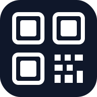

# 💎 SwiftQR 3D Studio — *The Future of QR Design*

<div align="center">
  
  <br />
  <p><b>Professional-grade 3D Glassmorphism QR Design Station</b></p>
  <p><i>Immersive. Advanced. Secure.</i></p>
  
  <br />

  [](./index.html)
  [](./LICENSE)
  [](./app.js)
</div>

---

### 🌟 Immersive Experience Meets Pro-Grade Logic
**SwiftQR 3D Studio** is not just another QR generator; it's a high-fidelity design workstation built for the modern web. Inspired by **iOS 18 aesthetics** and **Glassmorphism**, it combines tactile visual feedback with an advanced generation engine.

> [!TIP]
> Use the **Magic Wand** 🪄 to instantly extract the primary and secondary colors from your brand logo and apply them to the QR pattern!

---

## 🎨 Advanced Design Capabilities

### 🪄 Color Palette Intelligence
Upload your logo and let our "Magic Wand" engine scan the pixel data. It automatically identifies your brand's core palette and applies it to the dots and corner eyes for instant brand alignment.

### 🖼️ Advanced Logo Integration
- **Smart Masking**: Choose between `Square`, `Circle`, or `Seamless Overlay` cutouts.
- **Background Clearing**: Toggle a clean white buffer behind the logo to ensure scannability on dense patterns.
- **Safety Margins**: Precise control over the "Clear Zone" around your brand mark.

### 👁️ Corner Eye Sculpting
Break free from generic QR codes. Customize the **Outer Frame** and **Inner Dot** of the three corner "eyes" independently with various shapes (Square, Rounded, Extra-Rounded, Dot).

---

## 📇 Pro Identity Suite (vCard 3.0)

Go beyond simple URLs. Encode a full professional identity:
- **Social Link Bundle**: Built-in fields for **LinkedIn**, **Instagram**, and **WhatsApp** (encoded as `X-SOCIALPROFILE`).
- **Profile Picture Embedding**: Directly embed a compressed Base64 headshot into the QR code for instant face recognition on scan.
- **Contact Preview**: A pixel-perfect **iPhone 15 Pro mockup** allows you to see exactly how your contact will look in a recipient's phone before you export.

---

## 🚀 Technical Architecture

### ⚡ Performance & Offline
- **Service Worker (PWA)**: Full offline support. Generate, style, and export without an internet connection.
- **Debounced Rendering**: Real-time updates with 150ms throttling to ensure buttery-smooth UI interactions even on mobile.
- **Density Monitoring**: Automatic **Error Correction (ECC)** adjustment (up to `H` / 30%) when images or dense text are detected.

### 🛠️ The Stack
- **Engine**: [qr-code-styling](https://github.com/koobric/qr-code-styling)
- **Formatting**: [vcard-creator](https://github.com/jeroendesloovere/vcard-creator)
- **Icons**: [Lucide-JS](https://lucide.dev)
- **Styling**: Tailwind CSS + Custom 3D Mesh Shaders (CSS-only).

---

## 🏁 Quick Setup

1. **Clone & Serve**:
   ```bash
   git clone https://github.com/your-repo/swiftqr-3d-studio.git
   cd swiftqr-3d-studio
   # Use Python, Node, or VS Code Live Server
   python -m http.server 8000
   ```
2. **Access**: Open `http://localhost:8000` in your modern browser.

> [!IMPORTANT]
> **Clipboard Support**: Chrome/Safari require a **Secure Context (HTTPS)** to copy images to the clipboard. Use `localhost` for local testing.

---

## 📜 Author & License

- **Author**: [Hasan Rizvee](https://rizvee.github.io) 
- **GitHub**: [@rizvee](https://github.com/rizvee)
- **Portfolio**: [rizvee.github.io](https://rizvee.github.io)

Released under the **MIT License**. No data is ever sent to a server. All processing, compression, and generation happen **locally** in your browser.

---

<div align="center">
  <sub>Developed with ❤️ by <a href="https://rizvee.github.io">Hasan Rizvee</a></sub>
</div>
